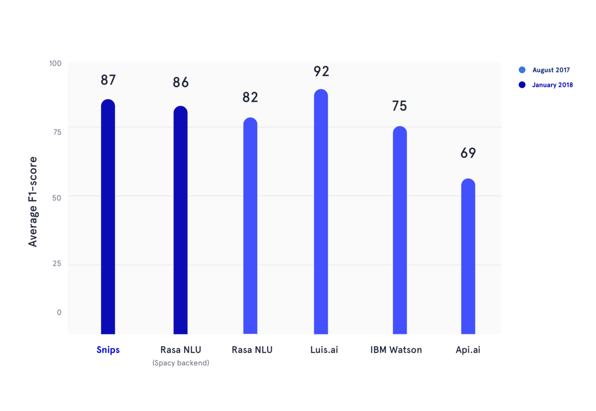

Snips NLU
=========

.. image:: https://travis-ci.org/snipsco/snips-nlu.svg?branch=master
   :target: https://travis-ci.org/snipsco/snips-nlu

.. image:: https://ci.appveyor.com/api/projects/status/github/snipsco/snips-nlu?branch=master&svg=true
   :target: https://ci.appveyor.com/project/snipsco/snips-nlu

.. image:: https://img.shields.io/pypi/v/snips-nlu.svg?branch=master
   :target: https://pypi.python.org/pypi/snips-nlu

.. image:: https://img.shields.io/pypi/pyversions/snips-nlu.svg?branch=master
   :target: https://pypi.python.org/pypi/snips-nlu

.. image:: https://codecov.io/gh/snipsco/snips-nlu/branch/master/graph/badge.svg
   :target: https://codecov.io/gh/snipsco/snips-nlu

.. image:: https://img.shields.io/twitter/url/http/shields.io.svg?style=social
   :target: https://twitter.com/intent/tweet?text=Extract%20meaning%20from%20text%20with%20Snips%20NLU,%20an%20open%20source%20library%20written%20in%20python%20and%20rust&url=https://github.com/snipsco/snips-nlu&via=snips&hashtags=nlu,nlp,machinelearning,python,rustlang

`Snips NLU <https://snips-nlu.readthedocs.io>`_ (Natural Language Understanding) is a Python library that allows to extract structured information from sentences written in natural language.

Summary
-------

- `What is Snips NLU about ?`_
- `Getting Started`_

  - `System requirements`_
  - `Installation`_
  - `Language Resources`_
- `API Usage`_

  - `Sample code`_
  - `Command Line Interface`_
- `Sample datasets`_
- `Benchmarks`_
- `Documentation`_
- `Citing Snips NLU`_
- `FAQ & Community`_
- `Related content`_
- `How do I contribute ?`_
- `Licence`_

What is Snips NLU about ?
-------------------------

Behind every chatbot and voice assistant lies a common piece of technology: Natural Language Understanding (NLU). Anytime a user interacts with an AI using natural language, their words need to be translated into a machine-readable description of what they meant.

The NLU engine first detects what the intention of the user is (a.k.a. `intent`_), then extracts the parameters (called `slots`_) of the query. The developer can then use this to determine the appropriate action or response.

Let’s take an example to illustrate this, and consider the following sentence:

.. code-block:: text

    "What will be the weather in paris at 9pm?"

Properly trained, the Snips NLU engine will be able to extract structured data such as:

.. code-block:: json

    {
       "intent": {
          "intentName": "searchWeatherForecast",
          "probability": 0.95
       },
       "slots": [
          {
             "value": "paris",
             "entity": "locality",
             "slotName": "forecast_locality"
          },
          {
             "value": {
                "kind": "InstantTime",
                "value": "2018-02-08 20:00:00 +00:00"
             },
             "entity": "snips/datetime",
             "slotName": "forecast_start_datetime"
          }
       ]
    }

In this case, the identified intent is ``searchWeatherForecast`` and two slots were extracted, a locality and a datetime. As you can see, Snips NLU does an extra step on top of extracting entities: it resolves them. The extracted datetime value has indeed been converted into a handy ISO format.

Check out our `blog post`_ to get more details about why we built Snips NLU and how it works under the hood. We also published a `paper on arxiv`_, presenting the machine learning architecture of the Snips Voice Platform.

Getting Started
---------------

-------------------
System requirements
-------------------

- Python 2.7 or Python >= 3.5
- RAM: Snips NLU will typically use between 100MB and 200MB of RAM, depending on the language and the size of the dataset.

------------
Installation
------------

.. code-block:: python

    pip install snips-nlu

We currently have pre-built binaries (wheels) for ``snips-nlu`` and its
dependencies for MacOS (10.11 and later), Linux x86_64 and Windows.

For any other architecture/os `snips-nlu` can be installed from the source
distribution. To do so, `Rust <https://www.rust-lang.org/en-US/install.html>`_
and `setuptools_rust <https://github.com/PyO3/setuptools-rust>`_ must be
installed before running the ``pip install snips-nlu`` command.

------------------
Language resources
------------------

Snips NLU relies on `external language resources`_ that must be downloaded before the
library can be used. You can fetch resources for a specific language by
running the following command:

.. code-block:: sh

    python -m snips_nlu download en

Or simply:

.. code-block:: sh

    snips-nlu download en

The list of supported languages is available at 
`this address <https://snips-nlu.readthedocs.io/en/latest/languages.html>`_.

API Usage
---------

----------------------
Command Line Interface
----------------------

The easiest way to test the abilities of this library is through the command line interface.

First, start by training the NLU with one of the `sample datasets`_:

.. code-block:: sh
    
    snips-nlu train path/to/dataset.json path/to/output_trained_engine

Where ``path/to/dataset.json`` is the path to the dataset which will be used during training, and ``path/to/output_trained_engine`` is the location where the trained engine should be persisted once the training is done.

After that, you can start parsing sentences interactively by running:

.. code-block:: sh
    
    snips-nlu parse path/to/trained_engine

Where ``path/to/trained_engine`` corresponds to the location where you have stored the trained engine during the previous step.

-----------
Sample code
-----------

Here is a sample code that you can run on your machine after having
installed `snips-nlu`, fetched the english resources and downloaded one of the `sample datasets`_:

.. code-block:: python

    >>> from __future__ import unicode_literals, print_function
    >>> import io
    >>> import json
    >>> from snips_nlu import SnipsNLUEngine
    >>> from snips_nlu.default_configs import CONFIG_EN
    >>> with io.open("sample_datasets/lights_dataset.json") as f:
    ...     sample_dataset = json.load(f)
    >>> nlu_engine = SnipsNLUEngine(config=CONFIG_EN)
    >>> nlu_engine = nlu_engine.fit(sample_dataset)
    >>> text = "Please turn the light on in the kitchen"
    >>> parsing = nlu_engine.parse(text)
    >>> parsing["intent"]["intentName"]
    'turnLightOn'

What it does is training an NLU engine on a sample weather dataset and parsing
a weather query.

Sample datasets
---------------

Here is a list of some datasets that can be used to train a Snips NLU engine:

- `Lights dataset <sample_datasets/lights_dataset.json>`_: "Turn on the lights in the kitchen", "Set the light to red in the bedroom"
- `Beverage dataset <sample_datasets/beverage_dataset.json>`_: "Prepare two cups of cappucino", "Make me a cup of tea"
- `Flights dataset <sample_datasets/flights_dataset.json>`_: "Book me a flight to go to boston this weekend", "book me some tickets from istanbul to moscow in three days"

Benchmarks
----------

In January 2018, we reproduced an `academic benchmark`_ which was published during the summer 2017. In this article, authors assessed the performance of API.ai (now Dialogflow, Google), Luis.ai (Microsoft), IBM Watson, and `Rasa NLU`_. For fairness, we used an updated version of Rasa NLU and compared it to the latest version of Snips NLU (both in dark blue).

In the figure above, `F1 scores`_ of both intent classification and slot filling were computed for several NLU providers, and averaged across the three datasets used in the academic benchmark mentionned before. All the underlying results can be found `here <https://github.com/snipsco/nlu-benchmark/tree/master/2018-01-Braum-et-al-extension>`_.

Documentation
-------------

To find out how to use Snips NLU please refer to the `package documentation <https://snips-nlu.readthedocs.io>`_, it will provide you with a step-by-step guide on how to setup and use this library.

Citing Snips NLU
----------------

Please cite the following paper when using Snips NLU:

.. code-block:: bibtex

   @article{coucke2018snips,
     title   = {Snips Voice Platform: an embedded Spoken Language Understanding system for private-by-design voice interfaces},
     author  = {Coucke, Alice and Saade, Alaa and Ball, Adrien and Bluche, Th{\'e}odore and Caulier, Alexandre and Leroy, David and Doumouro, Cl{\'e}ment and Gisselbrecht, Thibault and Caltagirone, Francesco and Lavril, Thibaut and others},
     journal = {arXiv preprint arXiv:1805.10190},
     pages   = {12--16},
     year    = {2018}
   }

FAQ & Community
---------------

Please join the `forum`_ to ask your questions and get feedback from the community.

Related content
---------------
* `What is Snips about ? <https://snips.ai/>`_
* Snips NLU Open sourcing `blog post`_
* `Snips Voice Platform paper (arxiv) <https://arxiv.org/abs/1805.10190>`_
* `Snips NLU Language Resources <https://github.com/snipsco/snips-nlu-language-resources>`_
* `Bug tracker <https://github.com/snipsco/snips-nlu/issues>`_
* `Snips NLU Rust <https://github.com/snipsco/snips-nlu-rs>`_: Rust inference pipeline implementation and bindings (C, Swift, Kotlin, Python)
* `Rustling <https://github.com/snipsco/rustling-ontology>`_: Snips NLU builtin entities parser

How do I contribute ?
---------------------

Please see the `Contribution Guidelines <CONTRIBUTING.rst>`_.

Licence
-------

This library is provided by `Snips <https://www.snips.ai>`_ as Open Source software. See `LICENSE <LICENSE>`_ for more information.

Geonames Licence
----------------

The `snips/city`, `snips/country` and `snips/region` builtin entities rely on
software from Geonames, which is made available under a Creative Commons Attribution 4.0
license international. For the license and warranties for Geonames please refer to: https://creativecommons.org/licenses/by/4.0/legalcode.

.. _external language resources: https://github.com/snipsco/snips-nlu-language-resources
.. _forum: https://forum.snips.ai/
.. _blog post: https://medium.com/snips-ai/an-introduction-to-snips-nlu-the-open-source-library-behind-snips-embedded-voice-platform-b12b1a60a41a
.. _paper on arxiv: https://arxiv.org/abs/1805.10190
.. _academic benchmark: http://workshop.colips.org/wochat/@sigdial2017/documents/SIGDIAL22.pdf
.. _Rasa NLU: https://nlu.rasa.ai/
.. _F1 scores: https://en.wikipedia.org/wiki/F1_score
.. _intent: https://snips-nlu.readthedocs.io/en/latest/data_model.html#intent
.. _slots: https://snips-nlu.readthedocs.io/en/latest/data_model.html#slot
